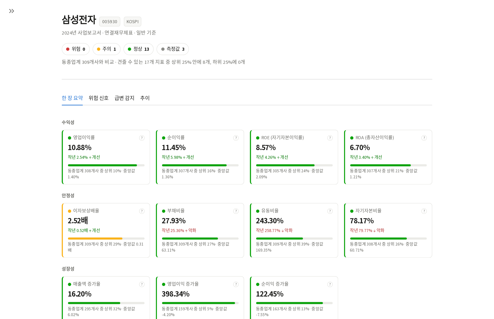
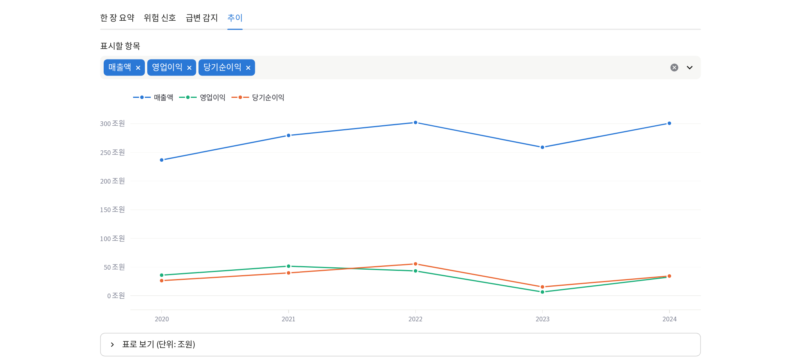
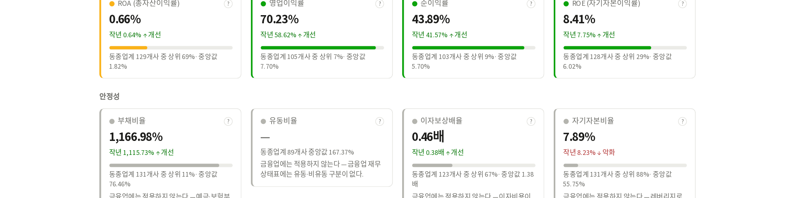

# fin-checkup

내 종목에 **위험 공시가 뜨면 알려주고**, 재무제표를 **건강검진 결과지처럼 신호등으로** 보여주는 도구.

> 도구만 제공한다. 종목 추천·투자 판단은 하지 않는다. "측정값 보고 + 사실 전달"만.

데이터 소스: **DART Open API**(금융감독원 전자공시)와 **SEC EDGAR**. 둘 다 상업 이용·재배포가 허용된 공개 데이터다.



숫자 하나에 맥락 세 겹이 붙는다 — **작년 대비**, **동종업계 안의 위치**, **업종 중앙값**.
"영업이익률 10.88%"만으로는 좋은지 알 수 없지만, "작년 2.54%에서 개선 · 동종업계 308개사 중
상위 10% · 중앙값 1.40%"는 판단할 수 있다.

---

## 두 개의 축

### 1. 위험 공시 알림 — 무료 대안이 없는 쪽

관심종목에 **유상증자·CB 발행·감사의견·최대주주 변동·부도·상장폐지** 공시가 뜨면 텔레그램으로 알린다.
전달하는 건 **어떤 공시가 떴다는 사실과 DART 원문 링크까지**다. "그러니 파세요"는 투자자문이고, 그 선은 넘지 않는다.

```bash
uv run python -m fin_checkup.cli bot --channel @채널이름
```

- **채널** — 시장 전체의 CRITICAL 공시만(하루 ~10건). 구독만 하면 되고 등록이 필요 없다.
- **봇** — `/watch 005930` 으로 등록하면 그 종목의 모든 위험 공시를 받는다.

볼륨은 추측이 아니라 [실측](#실데이터-검증)이다. 위험 공시는 하루 145.6건인데 그중 78%가 임원·대주주 소유 변동이라 채널로는 무의미하다. 그래서 채널과 봇의 기준선이 다르다.

> ⚠️ **발송 경로는 아직 실제 환경에서 검증되지 않았다.** 공시 수집·분류·중복 제거까지는 실데이터로 확인했지만, 텔레그램 API에 붙여 실제로 메시지를 보내본 적은 없다(봇 토큰 미발급, 목 테스트만 통과). 쓰려면 토큰을 발급받아 직접 확인하길 권한다.

### 2. 재무 건강검진

17개 지표를 🟢정상 / 🟡주의 / 🔴위험 / ⚪측정값 / ⊘해당없음 / ⚫데이터없음으로 표시하고 **설명·계산식·판정 경계값을 함께** 보여준다.

```bash
uv run python -m fin_checkup.cli checkup 005930     # 국내
uv run python -m fin_checkup.cli us AAPL            # 미국 (SEC EDGAR)
uv run streamlit run src/fin_checkup/app.py         # 웹 화면
```

| 묶음 | 지표 |
|---|---|
| 수익성 | 영업이익률 · 순이익률 · ROE · ROA |
| 안정성 | 부채비율 · 유동비율 · **이자보상배율** · 자기자본비율 |
| 성장성 | 매출액/영업이익/순이익 증가율 (흑자전환·적자지속 포함) |
| 이익의 질 | 영업활동현금흐름 · OCF÷순이익 · FCF |
| 효율성 | 총자산/재고자산/매출채권 회전율 |

여기에 **위험 신호**(자본잠식·연속 영업손실·흑자 현금유출)와 **급변 감지**(전기 대비 등급 하락)가 더해진다.



단위는 금액 크기에 맞춰 조/억을 고른다 — 300조를 "3M"으로 찍지 않는다.

---

## 설계 원칙 세 가지

### 데이터가 없으면 없다고 한다

공시에서 계정을 못 찾으면 0이 아니라 ⚫로 남긴다. 0으로 채우면 "부채 0원"처럼 읽혀 신호등 자체가 거짓말이 된다.

### 업종이 다르면 자도 다르다

은행에 유동비율을 들이대면 안 된다. 예금이 부채라 부채비율 1,000%가 정상이고 재고자산은 아예 없다. 실제로 KB금융을 일반 기업 기준으로 재보니 🔴가 4개 나왔다 — 국내 최대 금융지주인데도.

업종코드(KSIC)로 갈라 적용할 수 없는 지표는 ⊘로 표시하고 **대신 무엇을 봐야 하는지**를 함께 적는다.



### 계산이 된다고 판정해도 되는 건 아니다

적자 기업의 `현금흐름÷순이익`은 뜻이 뒤집힌다. 순손실 -100에 영업현금 +50이면 비율은 -0.5지만, 적자인데 현금이 들어온 건 나쁜 신호가 아니다. 이런 구간은 판정하지 않는다.

---

## 시작하기

```bash
uv sync --all-extras      # 웹 화면·API·테스트까지. CLI만 쓸 거면 `uv sync`
cp .env.example .env      # DART_API_KEY, TELEGRAM_BOT_TOKEN, SEC_USER_AGENT
uv run python -m fin_checkup.cli sync    # 종목 목록 (최초 1회)
```

| 키 | 어디서 | 무엇에 |
|---|---|---|
| `DART_API_KEY` | [opendart.fss.or.kr](https://opendart.fss.or.kr) — 이메일만, 즉시 | 국내 전체 |
| `TELEGRAM_BOT_TOKEN` | [@BotFather](https://t.me/BotFather) — 무료 | 알림 |
| `SEC_USER_AGENT` | 직접 작성 (`fin-checkup you@example.com`) | 미장 |

> ⚠️ DART 약관 제19조에 따라 인증키를 제3자에게 넘기면 안 된다. `.env`는 커밋되지 않는다.

### 그 외 명령

```bash
uv run python -m fin_checkup.cli watch add 005930   # 관심종목
uv run python -m fin_checkup.cli poll --dry-run     # 알림 미리보기
uv run python -m fin_checkup.cli budget             # 오늘 DART 호출량
uv run python -m fin_checkup.cli serve --port 8000  # HTTP API (/docs)
uv run python -m fin_checkup.cli collect --limit 50 # 업종 비교용 캐시 채우기
```

API 서버는 한 프로세스가 캐시를 소유하고 알림 워커를 안에서 함께 돌린다. DuckDB가 단일 writer라 워커를 따로 띄우면 락에서 부딪히기 때문이다 — [docs/OPERATIONS.md](./docs/OPERATIONS.md) 참고.

---

## 구조

```
src/fin_checkup/
├── dart/            DART Open API + XBRL 계정 정규화 + 재시도
├── sec/             SEC EDGAR → 같은 Financials 모델
├── metrics/         지표 · 신호등 · 위험 신호 · 급변 · 업종 · 업종 비교
├── alerts/          공시 분류 · 메시지 · 텔레그램 · 워커 · 스케줄러 · 봇
├── storage/db.py    DuckDB 캐시 (원본 계정 줄을 그대로 보관)
├── api/             FastAPI (워커를 백그라운드로 함께 실행)
├── auth.py          계정·API 키 (해시만 저장)
├── service.py       조율 계층 — UI를 모른다
├── cli.py           터미널 진입점
└── app.py           Streamlit 화면
```

CLI·Streamlit·FastAPI가 모두 `service.py`를 쓴다. 지표 엔진은 DART와 SEC 어느 쪽이든 코드 수정 없이 돈다.

---

## 실데이터 검증

전체 상장사를 대상으로 2024·2023 사업연도를 조회해 **2024년 2,759사 · 2023년 2,668사**의 재무를
확보했다(**호출 실패 0건**. 나머지는 상장폐지 등으로 해당 연도 공시가 없었다).

- **계정 정규화** — 비금융 상장사에서 핵심 계정 누락률 **0.1~0.8%**
- **업종 비교** — 62개 업종군, **99.2%**가 비교 가능 (표본 중앙값 17개사)
- **신호등 분포** — 수익성 🟢25 / 🟡39 / 🔴35 (재조정 전에는 🔴가 64.5%)
- **경계값** — 통용 기준을 옮겨놓은 게 아니라 실제 시장 분위수로 맞췄다. 근거는 `metrics/engine.py` 주석에
- **조회 속도** — 검진 한 건 **96ms** (대조군을 미리 계산해두기 전에는 16.3초)

실데이터를 통과시키고 나서야 드러난 결함들이다. 큰 것 넷:

| 결함 | 증상 |
|---|---|
| corp_code 8,444건 유실 | 삽입이 타임아웃에 잘렸는데 성공으로 보고됨 |
| 은행 오판정 | 건전한 금융지주가 🔴 4개 |
| 경계값 왜곡 | 상장사 과반이 "위험" — 신호등에 정보가 없음 |
| 업종 표본 부족 | 업종코드가 318개로 쪼개져 절반이 비교 불가 |

---

## 개발

```bash
uv run pytest                          # 419 tests
uv run ruff check src tests scripts
```

실데이터 분석 도구:

```bash
uv run python scripts/collect_universe.py --year 2024 --limit 1000   # 캐시 채우기
uv run python scripts/analyze_universe.py --year 2024                # 누락률·지표 분포
uv run python scripts/check_sectors.py --year 2024                   # 업종별 판정 왜곡
```

수집 뒤에는 대조군용 지표를 미리 계산해둔다 (DART 호출 없음, 5천사에 44초):

```bash
uv run python -m fin_checkup.cli backfill --year 2024 --years 2
```

## 문서

- [docs/OPERATIONS.md](./docs/OPERATIONS.md) — 운영 (프로세스 구조·호출 예산·장애 대응)
- [docs/REGULATORY.md](./docs/REGULATORY.md) — 지켜야 하는 선 (무료로 풀어도 그대로다)
- [docs/TERMS.md](./docs/TERMS.md) · [docs/PRIVACY.md](./docs/PRIVACY.md) — 약관·방침 초안

## 라이선스

**MIT.** 가져다 쓰고 고치고 팔아도 된다. 전문은 [LICENSE](./LICENSE).

조회하는 **데이터는 애초에 내 것이 아니다.** DART는 공공데이터로 상업 이용·재배포가 허용되고 SEC EDGAR는 퍼블릭 도메인이다. 다만 DART 인증키는 개인에게 발급된 것이니 포크할 때 자기 키를 함께 넘기지 말 것 — 라이선스와 별개로 붙는 조건들은 [docs/REGULATORY.md](./docs/REGULATORY.md)에 모아뒀다.

## 면책

본 서비스는 소프트웨어 도구이며 투자권유·투자자문을 제공하지 않는다. 표시되는 정보는 공시 수치를 공개된 재무비율 공식으로 계산한 객관적 측정 결과다. 데이터 정확성 및 이용에 따른 손익에 운영자는 책임지지 않는다.
